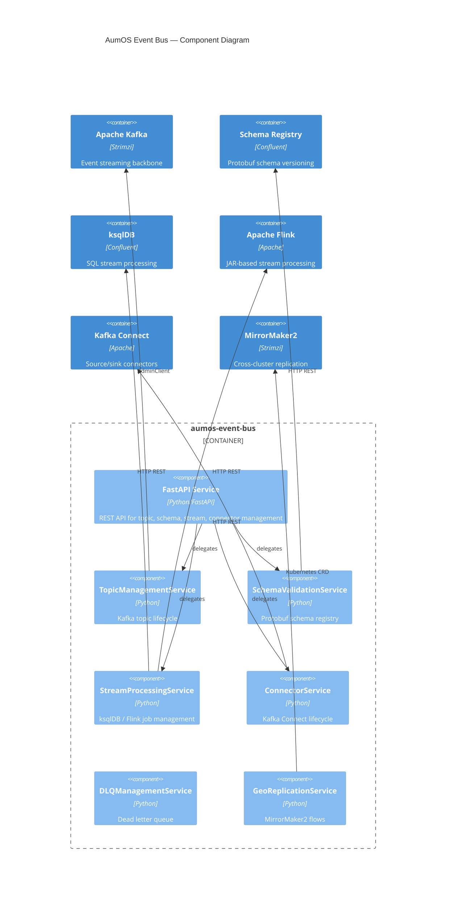

# Architecture

## Component Overview



## Hexagonal Architecture

```
api/          — FastAPI routes (thin, delegates to core)
core/         — Business logic services and domain models
adapters/     — Kafka AdminClient, Schema Registry, ksqlDB, Flink, Connect clients
```

## Tenant Isolation

All topics, consumer groups, and connectors are prefixed or filtered by `tenant_id`.
The `TenantPartitioner` uses SHA-256 to deterministically map tenants to partitions,
ensuring per-tenant message ordering without dedicated partitions.

## Event Publishing

Domain events are published to Kafka via `aumos-common.EventPublisher` after every
state change (topic created, schema registered, connector created).
Audit events go to `aumos.audit.{tenant_id}`.
