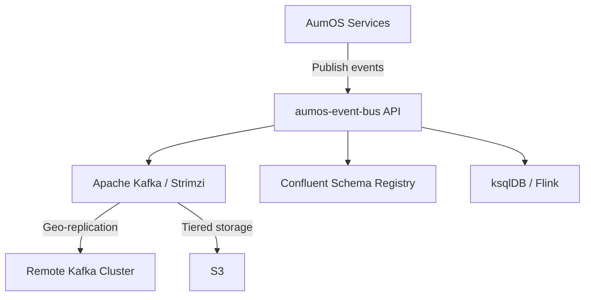

# AumOS Event Bus

**AumOS Event Bus** is the Kafka-based event streaming backbone for the AumOS Enterprise AI platform.
It provides topic lifecycle management, Protobuf schema registry integration, tenant-aware partitioning,
dead letter queue (DLQ) management, stream processing orchestration, and geo-replication.

## Key Features

- **Topic Management** — Provision, configure, and delete Kafka topics with tenant isolation
- **Schema Registry** — Protobuf schema registration with backward compatibility enforcement and evolution preview
- **Stream Processing** — ksqlDB and Apache Flink job management via declarative API
- **Consumer Group Monitoring** — Real-time lag visibility per consumer group and partition
- **Event Replay** — Reset consumer group offsets to reprocess events from any point
- **Dead Letter Queue** — Exponential backoff retry, operator tooling for failed messages
- **Geo-Replication** — Cross-cluster MirrorMaker2 replication flows for DR and data sovereignty
- **Tiered Storage** — S3-backed long-retention storage configuration for cost-effective archival

## Architecture

## Quick Links

- [Quickstart](quickstart.md) — Get your first topic running
- [API Reference](api-reference.md) — Full endpoint documentation
- [Stream Processing Guide](guides/stream-processing.md) — ksqlDB and Flink jobs
